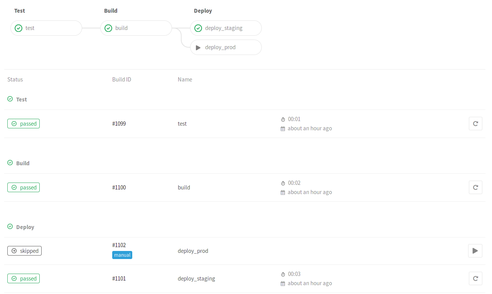
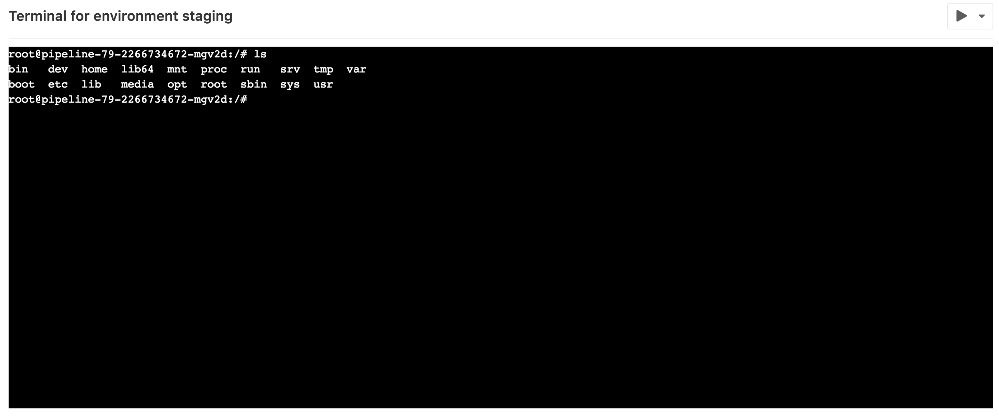
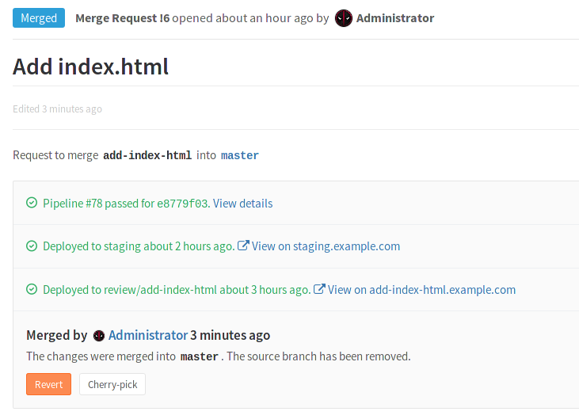
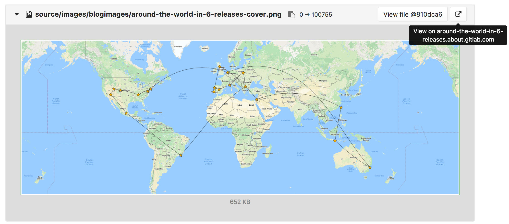
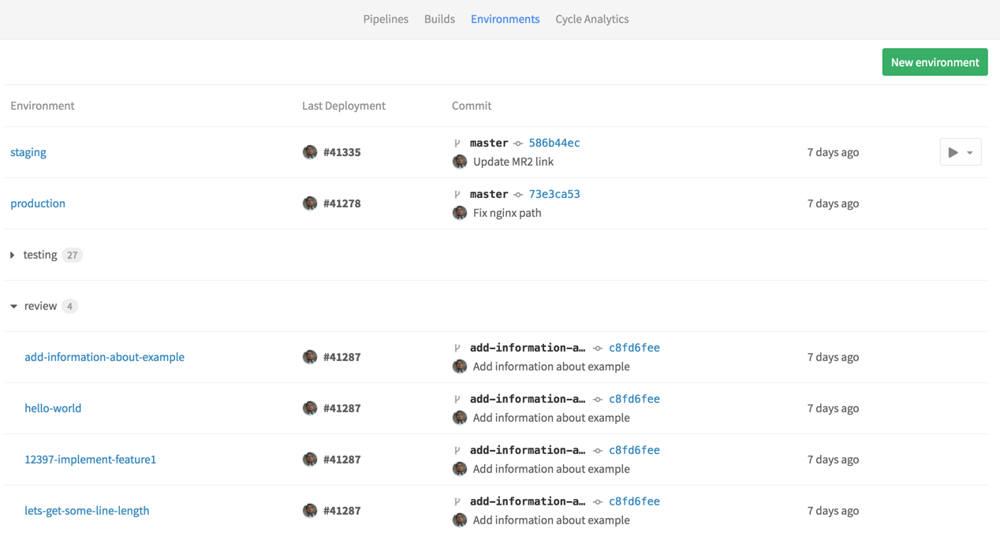
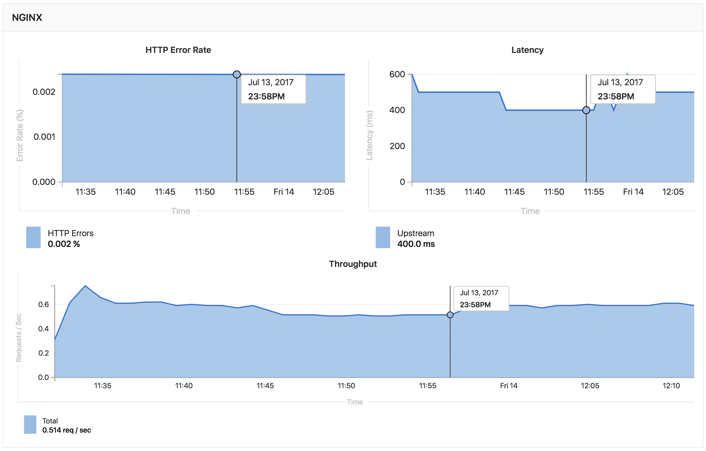

# Introduction to environments and deployments

> Introduced in GitLab 8.9.

During the development of software, there can be many stages until it's ready
for public consumption. You sure want to first test your code and then deploy it
in a testing or staging environment before you release it to the public. That
way you can prevent bugs not only in your software, but in the deployment
process as well.

GitLab CI is capable of not only testing or building your projects, but also
deploying them in your infrastructure, with the added benefit of giving you a
way to track your deployments. In other words, you can always know what is
currently being deployed or has been deployed on your servers.

## Overview

With environments, you can control the Continuous Deployment of your software
all within GitLab. All you need to do is define them in your project's
[`.gitlab-ci.yml`][yaml] as we will explore below. GitLab provides a full
history of your deployments per every environment.

Environments are like tags for your CI jobs, describing where code gets deployed.
Deployments are created when [jobs] deploy versions of code to environments,
so every environment can have one or more deployments. GitLab keeps track of
your deployments, so you always know what is currently being deployed on your
servers. If you have a deployment service such as [Kubernetes][kubernetes-service]
enabled for your project, you can use it to assist with your deployments, and
can even access a web terminal for your environment from within GitLab!

To better understand how environments and deployments work, let's consider an
example. We assume that you have already created a project in GitLab and set up
a Runner. The example will cover the following:

- We are developing an application
- We want to run tests and build our app on all branches
- Our default branch is `master`
- We deploy the app only when a pipeline on `master` branch is run

Let's see how it all ties together.

## Defining environments

Let's consider the following `.gitlab-ci.yml` example:

```yaml
stages:
  - test
  - build
  - deploy

test:
  stage: test
  script: echo "Running tests"

build:
  stage: build
  script: echo "Building the app"

deploy_staging:
  stage: deploy
  script:
    - echo "Deploy to staging server"
  environment:
    name: staging
    url: https://staging.example.com
  only:
  - master
```

We have defined 3 [stages](yaml/README.md#stages):

- test
- build
- deploy

The jobs assigned to these stages will run in this order. If a job fails, then
the jobs that are assigned to the next stage won't run, rendering the pipeline
as failed. In our case, the `test` job will run first, then the `build` and
lastly the `deploy_staging`. With this, we ensure that first the tests pass,
then our app is able to be built successfully, and lastly we deploy to the
staging server.

The `environment` keyword is just a hint for GitLab that this job actually
deploys to this environment's `name`. It can also have a `url` which, as we
will later see, is exposed in various places within GitLab. Each time a job that
has an environment specified and succeeds, a deployment is recorded, remembering
the Git SHA and environment name.

>**Note:**
Starting with GitLab 8.15, the environment name is exposed to the Runner in
two forms: `$CI_ENVIRONMENT_NAME`, and `$CI_ENVIRONMENT_SLUG`. The first is
the name given in `.gitlab-ci.yml` (with any variables expanded), while the
second is a "cleaned-up" version of the name, suitable for use in URLs, DNS,
etc.

>**Note:**
Starting with GitLab 9.3, the environment URL is exposed to the Runner via
`$CI_ENVIRONMENT_URL`. The URL would be expanded from `.gitlab-ci.yml`, or if
the URL was not defined there, the external URL from the environment would be
used.

To sum up, with the above `.gitlab-ci.yml` we have achieved that:

- All branches will run the `test` and `build` jobs.
- The `deploy_staging` job will run [only](yaml/README.md#only) on the `master`
  branch which means all merge requests that are created from branches don't
  get to deploy to the staging server
- When a merge request is merged, all jobs will run and the `deploy_staging`
  in particular will deploy our code to a staging server while the deployment
  will be recorded in an environment named `staging`.

Let's now see how that information is exposed within GitLab.

## Viewing the current status of an environment

The environment list under your project's **Pipelines ➔ Environments**, is
where you can find information of the last deployment status of an environment.

Here's how the Environments page looks so far.


There's a bunch of information there, specifically you can see:

- The environment's name with a link to its deployments
- The last deployment ID number and who performed it
- The job ID of the last deployment with its respective job name
- The commit information of the last deployment such as who committed, to what
  branch and the Git SHA of the commit
- The exact time the last deployment was performed
- A button that takes you to the URL that you have defined under the
  `environment` keyword in `.gitlab-ci.yml`
- A button that re-deploys the latest deployment, meaning it runs the job
  defined by the environment name for that specific commit

>**Notes:**
- While you can create environments manually in the web interface, we recommend
  that you define your environments in `.gitlab-ci.yml` first. They will
  be automatically created for you after the first deploy.
- The environments page can only be viewed by Reporters and above. For more
  information on the permissions, see the [permissions documentation][permissions].
- Only deploys that happen after your `.gitlab-ci.yml` is properly configured
  will show up in the "Environment" and "Last deployment" lists.

The information shown in the Environments page is limited to the latest
deployments, but as you may have guessed an environment can have multiple
deployments.

## Viewing the deployment history of an environment

GitLab keeps track of your deployments, so you always know what is currently
being deployed on your servers. That way you can have the full history of your
deployments per every environment right in your browser. Clicking on an
environment will show the history of its deployments. Assuming you have deployed
multiple times already, here's how a specific environment's page looks like.


We can see the same information as when in the Environments page, but this time
all deployments are shown. As you may have noticed, apart from the **Re-deploy**
button there are now **Rollback** buttons for each deployment. Let's see how
that works.

## Rolling back changes

You can't control everything, so sometimes things go wrong. When that unfortunate
time comes GitLab has you covered. Simply by clicking the **Rollback** button
that can be found in the deployments page
(**Pipelines ➔ Environments ➔ `environment name`**) you can relaunch the
job with the commit associated with it.

>**Note:**
Bear in mind that your mileage will vary and it's entirely up to how you define
the deployment process in the job's `script` whether the rollback succeeds or not.
GitLab CI is just following orders.

Thankfully that was the staging server that we had to rollback, and since we
learn from our mistakes, we decided to not make the same again when we deploy
to the production server. Enter manual actions for deployments.

## Manually deploying to environments

Turning a job from running automatically to a manual action is as simple as
adding `when: manual` to it. To expand on our previous example, let's add
another job that this time deploys our app to a production server and is
tracked by a `production` environment. The `.gitlab-ci.yml` looks like this
so far:

```yaml
stages:
  - test
  - build
  - deploy

test:
  stage: test
  script: echo "Running tests"

build:
  stage: build
  script: echo "Building the app"

deploy_staging:
  stage: deploy
  script:
    - echo "Deploy to staging server"
  environment:
    name: staging
    url: https://staging.example.com
  only:
  - master

deploy_prod:
  stage: deploy
  script:
    - echo "Deploy to production server"
  environment:
    name: production
    url: https://example.com
  when: manual
  only:
  - master
```

The `when: manual` action exposes a play button in GitLab's UI and the
`deploy_prod` job will only be triggered if and when we click that play button.
You can find it in the pipeline, job, environment, and deployment views.

| Pipelines | Single pipeline | Environments | Deployments | jobs |
| --------- | ----------------| ------------ | ----------- | -------|
|  |  |  |  |  |

Clicking on the play button in either of these places will trigger the
`deploy_prod` job, and the deployment will be recorded under a new
environment named `production`.

>**Note:**
Remember that if your environment's name is `production` (all lowercase), then
it will get recorded in [Cycle Analytics](../user/project/cycle_analytics.md).
Double the benefit!

## Web terminals

>**Note:**
Web terminals were added in GitLab 8.15 and are only available to project
masters and owners.

If you deploy to your environments with the help of a deployment service (e.g.,
the [Kubernetes service][kubernetes-service], GitLab can open
a terminal session to your environment! This is a very powerful feature that
allows you to debug issues without leaving the comfort of your web browser. To
enable it, just follow the instructions given in the service documentation.

Once enabled, your environments will gain a "terminal" button:


You can also access the terminal button from the page for a specific environment:


Wherever you find it, clicking the button will take you to a separate page to
establish the terminal session:



This works just like any other terminal - you'll be in the container created
by your deployment, so you can run shell commands and get responses in real
time, check the logs, try out configuration or code tweaks, etc. You can open
multiple terminals to the same environment - they each get their own shell
session -  and even a multiplexer like `screen` or `tmux`!

>**Note:**
Container-based deployments often lack basic tools (like an editor), and may
be stopped or restarted at any time. If this happens, you will lose all your
changes! Treat this as a debugging tool, not a comprehensive online IDE. You
can use [Koding](../administration/integration/koding.md) for online
development.

---

While this is fine for deploying to some stable environments like staging or
production, what happens for branches? So far we haven't defined anything
regarding deployments for branches other than `master`. Dynamic environments
will help us achieve that.

## Dynamic environments

As the name suggests, it is possible to create environments on the fly by just
declaring their names dynamically in `.gitlab-ci.yml`. Dynamic environments is
the basis of [Review apps](review_apps/index.md).

GitLab Runner exposes various [environment variables][variables] when a job runs,
and as such, you can use them as environment names. Let's add another job in
our example which will deploy to all branches except `master`:

```yaml
deploy_review:
  stage: deploy
  script:
    - echo "Deploy a review app"
  environment:
    name: review/$CI_COMMIT_REF_NAME
    url: https://$CI_ENVIRONMENT_SLUG.example.com
  only:
    - branches
  except:
    - master
```

Let's break it down in pieces. The job's name is `deploy_review` and it runs
on the `deploy` stage. The `script` at this point is fictional, you'd have to
use your own based on your deployment. Then, we set the `environment` with the
`environment:name` being `review/$CI_COMMIT_REF_NAME`. Now that's an interesting
one. Since the [environment name][env-name] can contain slashes (`/`), we can
use this pattern to distinguish between dynamic environments and the regular
ones.

So, the first part is `review`, followed by a `/` and then `$CI_COMMIT_REF_NAME`
which takes the value of the branch name. Since `$CI_COMMIT_REF_NAME` itself may
also contain `/`, or other characters that would be invalid in a domain name or
URL, we use `$CI_ENVIRONMENT_SLUG` in the `environment:url` so that the
environment can get a specific and distinct URL for each branch. In this case,
given a `$CI_COMMIT_REF_NAME` of `100-Do-The-Thing`, the URL will be something
like `https://100-do-the-4f99a2.example.com`. Again, the way you set up
the web server to serve these requests is based on your setup.

You could also use `$CI_COMMIT_REF_SLUG` in `environment:url`, e.g.:
`https://$CI_COMMIT_REF_SLUG.example.com`. We use `$CI_ENVIRONMENT_SLUG`
here because it is guaranteed to be unique, but if you're using a workflow like
[GitLab Flow][gitlab-flow], collisions are very unlikely, and you may prefer
environment names to be more closely based on the branch name - the example
above would give you an URL like `https://100-do-the-thing.example.com`

Last but not least, we tell the job to run [`only`][only] on branches
[`except`][only] master.

>**Note:**
You are not bound to use the same prefix or only slashes in the dynamic
environments' names (`/`), but as we will see later, this will enable the
[grouping similar environments](#grouping-similar-environments) feature.

The whole `.gitlab-ci.yml` looks like this so far:

```yaml
stages:
  - test
  - build
  - deploy

test:
  stage: test
  script: echo "Running tests"

build:
  stage: build
  script: echo "Building the app"

deploy_review:
  stage: deploy
  script:
    - echo "Deploy a review app"
  environment:
    name: review/$CI_COMMIT_REF_NAME
    url: https://$CI_ENVIRONMENT_SLUG.example.com
  only:
    - branches
  except:
    - master

deploy_staging:
  stage: deploy
  script:
    - echo "Deploy to staging server"
  environment:
    name: staging
    url: https://staging.example.com
  only:
  - master

deploy_prod:
  stage: deploy
  script:
    - echo "Deploy to production server"
  environment:
    name: production
    url: https://example.com
  when: manual
  only:
  - master
```

A more realistic example would include copying files to a location where a
webserver (NGINX) could then read and serve. The example below will copy the
`public` directory to `/srv/nginx/$CI_COMMIT_REF_SLUG/public`:

```yaml
review_app:
  stage: deploy
  script:
    - rsync -av --delete public /srv/nginx/$CI_COMMIT_REF_SLUG
  environment:
    name: review/$CI_COMMIT_REF_NAME
    url: https://$CI_COMMIT_REF_SLUG.example.com
```

It is assumed that the user has already setup NGINX and GitLab Runner in the
server this job will run on.

>**Note:**
Be sure to check out the [limitations](#limitations) section for some edge
cases regarding naming of your branches and Review Apps.

---

The development workflow would now be:

- Developer creates a branch locally
- Developer makes changes, commits and pushes the branch to GitLab
- Developer creates a merge request

Behind the scenes:

- GitLab Runner picks up the changes and starts running the jobs
- The jobs run sequentially as defined in `stages`
  - First, the tests pass
  - Then, the job begins and successfully also passes
  - Lastly, the app is deployed to an environment with a name specific to the
    branch

So now, every branch gets its own environment and is deployed to its own place
with the added benefit of having a [history of deployments](#viewing-the-deployment-history-of-an-environment)
and also being able to [rollback changes](#rolling-back-changes) if needed.
Let's briefly see where URL that's defined in the environments is exposed.

## Making use of the environment URL

The environment URL is exposed in a few places within GitLab.

| In a merge request widget as a link | In the Environments view as a button | In the Deployments view as a button |
| -------------------- | ------------ | ----------- |
|  |  |  |

If a merge request is eventually merged to the default branch (in our case
`master`) and that branch also deploys to an environment (in our case `staging`
and/or `production`) you can see this information in the merge request itself.



### Go directly from source files to public pages on the environment

> Introduced in GitLab 8.17.

To go one step further, we can specify a Route Map to get GitLab to show us "View on [environment URL]" buttons to go directly from a file to that file's representation on the deployed website. It will be exposed in a few places:

| In the diff for a merge request, comparison or commit | In the file view |
| ------ | ------ |
|  |  |

To get this to work, you need to tell GitLab how the paths of files in your repository map to paths of pages on your website, using a Route Map.

A Route Map is a file inside the repository at `.gitlab/route-map.yml`, which contains a YAML array that maps `source` paths (in the repository) to `public` paths (on the website).

This is an example of a route map for [Middleman](https://middlemanapp.com) static websites like [http://about.gitlab.com](https://gitlab.com/gitlab-com/www-gitlab-com):

```yaml
# Team data
- source: 'data/team.yml' # data/team.yml
  public: 'team/' # team/

# Blogposts
- source: /source\/posts\/([0-9]{4})-([0-9]{2})-([0-9]{2})-(.+?)\..*/ # source/posts/2017-01-30-around-the-world-in-6-releases.html.md.erb
  public: '\1/\2/\3/\4/' # 2017/01/30/around-the-world-in-6-releases/

# HTML files
- source: /source\/(.+?\.html).*/ # source/index.html.haml
  public: '\1' # index.html

# Other files
- source: /source\/(.*)/ # source/images/blogimages/around-the-world-in-6-releases-cover.png
  public: '\1' # images/blogimages/around-the-world-in-6-releases-cover.png
```

Mappings are defined as entries in the root YAML array, and are identified by a `-` prefix. Within an entry, we have a hash map with two keys:

- `source`
    - a string, starting and ending with `'`, for an exact match
    - a regular expression, starting and ending with `/`, for a pattern match
      - The regular expression needs to match the entire source path - `^` and `$` anchors are implied.
      - Can include capture groups denoted by `()` that can be referred to in the `public` path.
      - Slashes (`/`) can, but don't have to, be escaped as `\/`.
      - Literal periods (`.`) should be escaped as `\.`.
- `public`
    - a string, starting and ending with `'`.
      - Can include `\N` expressions to refer to capture groups in the `source` regular expression in order of their occurence, starting with `\1`.

The public path for a source path is determined by finding the first `source` expression that matches it, and returning the corresponding `public` path, replacing the `\N` expressions with the values of the `()` capture groups if appropriate.

In the example above, the fact that mappings are evaluated in order of their definition is used to ensure that `source/index.html.haml` will match `/source\/(.+?\.html).*/` instead of `/source\/(.*)/`, and will result in a public path of `index.html`, instead of `index.html.haml`.

---

We now have a full development cycle, where our app is tested, built, deployed
as a Review app, deployed to a staging server once the merge request is merged,
and finally manually deployed to the production server. What we just described
is a single workflow, but imagine tens of developers working on a project
at the same time. They each push to their branches, and dynamic environments are
created all the time. In that case, we probably need to do some clean up. Read
next how environments can be stopped.

## Stopping an environment

By stopping an environment, you are effectively terminating its recording of the
deployments that happen in it.

A branch is associated with an environment when the CI pipeline that is created
for this branch, was recently deployed to this environment. You can think of
the CI pipeline as the glue between the branch and the environment:
`branch ➔ CI pipeline ➔ environment`.

There is a special case where environments can be manually stopped. That can
happen if you provide another job for that matter. The syntax is a little
tricky since a job calls another job to do the job.

Consider the following example where the `deploy_review` calls the `stop_review`
to clean up and stop the environment:

```yaml
deploy_review:
  stage: deploy
  script:
    - echo "Deploy a review app"
  environment:
    name: review/$CI_COMMIT_REF_NAME
    url: https://$CI_ENVIRONMENT_SLUG.example.com
    on_stop: stop_review
  only:
    - branches
  except:
    - master

stop_review:
  stage: deploy
  variables:
    GIT_STRATEGY: none
  script:
    - echo "Remove review app"
  when: manual
  environment:
    name: review/$CI_COMMIT_REF_NAME
    action: stop
```

Setting the [`GIT_STRATEGY`][git-strategy] to `none` is necessary on the
`stop_review` job so that the [GitLab Runner] won't try to checkout the code
after the branch is deleted.

>**Note:**
Starting with GitLab 8.14, dynamic environments will be stopped automatically
when their associated branch is deleted.

When you have an environment that has a stop action defined (typically when
the environment describes a review app), GitLab will automatically trigger a
stop action when the associated branch is deleted. The `stop_review` job must
be in the same `stage` as the `deploy_review` one in order for the environment
to automatically stop.

You can read more in the [`.gitlab-ci.yml` reference][onstop].

## Grouping similar environments

> [Introduced][ce-7015] in GitLab 8.14.

As we've seen in the [dynamic environments](#dynamic-environments), you can
prepend their name with a word, then followed by a `/` and finally the branch
name which is automatically defined by the `CI_COMMIT_REF_NAME` variable.

In short, environments that are named like `type/foo` are presented under a
group named `type`.

In our minimal example, we name the environments `review/$CI_COMMIT_REF_NAME`
where `$CI_COMMIT_REF_NAME` is the branch name:

```yaml
deploy_review:
  stage: deploy
  script:
    - echo "Deploy a review app"
  environment:
    name: review/$CI_COMMIT_REF_NAME
```

In that case, if you visit the Environments page, and provided the branches
exist, you should see something like:



## Monitoring environments

>**Notes:**
>
- For the monitor dashboard to appear, you need to:
  - Have enabled the [Kubernetes integration][kube]
  - Have your app deployed on Kubernetes
  - Have enabled the [Prometheus integration][prom]
- With GitLab 9.2, all deployments to an environment are shown directly on the
  monitoring dashboard

If your application is deployed on Kubernetes and you have enabled Prometheus
collecting metrics, you can monitor the performance behavior of your app
through the environments.

Once configured, GitLab will attempt to retrieve performance metrics for any
environment which has had a successful deployment. If monitoring data was
successfully retrieved, a Monitoring button will appear on the environment's
detail page.


Clicking on the Monitoring button will display a new page, showing up to the last
8 hours of performance data. It may take a minute or two for data to appear
after initial deployment.

All deployments to an environment are shown directly on the monitoring dashboard
which allows easy correlation between any changes in performance and a new
version of the app, all without leaving GitLab.



## Checkout deployments locally

Since 8.13, a reference in the git repository is saved for each deployment, so
knowing the state of your current environments is only a `git fetch` away.

In your git config, append the `[remote "<your-remote>"]` block with an extra
fetch line:

```
fetch = +refs/environments/*:refs/remotes/origin/environments/*
```

## Limitations

1. You are limited to use only the [CI predefined variables][variables] in the
   `environment: name`. If you try to re-use variables defined inside `script`
   as part of the environment name, it will not work.

## Further reading

Below are some links you may find interesting:

- [The `.gitlab-ci.yml` definition of environments](yaml/README.md#environment)
- [A blog post on Deployments & Environments](https://about.gitlab.com/2016/08/26/ci-deployment-and-environments/)
- [Review Apps - Use dynamic environments to deploy your code for every branch](review_apps/index.md)
- [Deploy Boards for your applications running on Kubernetes](../user/project/deploy_boards.md)

[Pipelines]: pipelines.md
[jobs]: yaml/README.md#jobs
[yaml]: yaml/README.md
[kubernetes-service]: ../user/project/integrations/kubernetes.md
[environments]: #environments
[deployments]: #deployments
[permissions]: ../user/permissions.md
[variables]: variables/README.md
[env-name]: yaml/README.md#environment-name
[only]: yaml/README.md#only-and-except
[onstop]: yaml/README.md#environment-on_stop
[ce-7015]: https://gitlab.com/gitlab-org/gitlab-ce/merge_requests/7015
[gitlab-flow]: ../workflow/gitlab_flow.md
[gitlab runner]: https://docs.gitlab.com/runner/
[git-strategy]: yaml/README.md#git-strategy
[kube]: ../user/project/integrations/kubernetes.md
[prom]: ../user/project/integrations/prometheus.md
