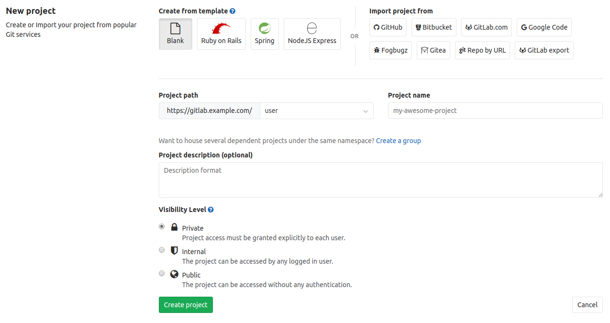

# How to create a project in GitLab

1. In your dashboard, click the green **New project** button or use the plus
   icon in the upper right corner of the navigation bar.

    

1. This opens the **New project** page.

    

1. Choose if you want start a blank project, or with one of the predefined
   [Project Templates](https://gitlab.com/gitlab-org/project-templates):
   this will kickstart your repository code and CI automatically.
   Otherwise, if you have a project in a different repository, you can [import it] by
   clicking an **Import project from** button provided this is enabled in
   your GitLab instance. Ask your administrator if not.

1. Provide the following information:
    - Enter the name of your project in the **Project name** field. You can't use
      special characters, but you can use spaces, hyphens, underscores or even
      emoji.
    - The **Project description (optional)** field enables you to enter a
      description for your project's dashboard, which will help others
      understand what your project is about. Though it's not required, it's a good
      idea to fill this in.
    - Changing the **Visibility Level** modifies the project's
      [viewing and access rights](../public_access/public_access.md) for users.

1. Click **Create project**.

[import it]: ../workflow/importing/README.md
