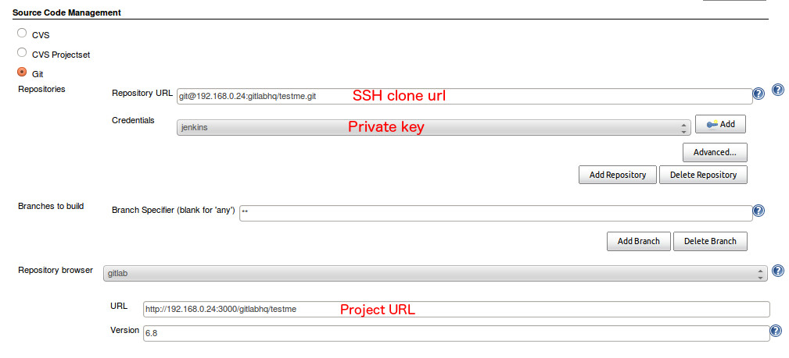
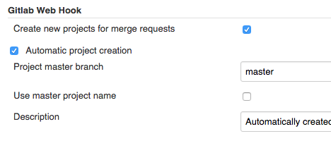
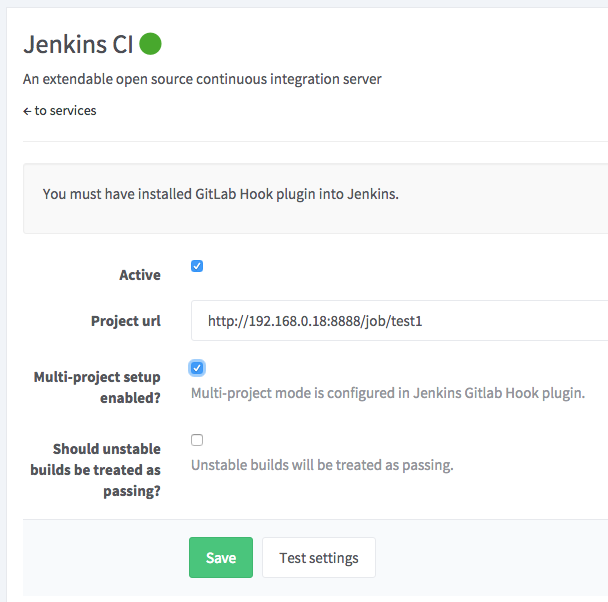

# Jenkins CI integration

GitLab can be configured to interact with Jenkins

Integration includes: 

* Trigger Jenkins build after push to repo
* Show build status on Merge Request page

Requirements: 

* Jenkins GitLab Hook plugin
* git clone access for Jenkins from GitLab repo (via ssh key)

## Jenkins

1. Install GitLab Hook plugin
2. Setup jenkins project

## GitLab

### Read access to repository 

Jenkins need read access to GitLab repository. We already specified private key to use in Jenkins. Now we need to add public key to GitLab project

### Jenkins service

Now navigate to GitLab services page and activate Jenkins

Done! Now when you push to GitLab - it will create a build for Jenkins.
And also you will be able to see merge request build status with a link to the Jenkins build.

### Multi-project Configuration

The GitLab Hook plugin in Jenkins supports the automatic creation of a project
for each feature branch. After configuration GitLab will trigger feature branch
builds and a corresponding project will be created in Jenkins.

Configure the GitLab Hook plugin in Jenkins. Go to 'Manage Jenkins' and then
'Configure System'. Find the 'GitLab Web Hook' section and configure as shown below.

In the Jenkins service in GitLab, check the 'Multi-project setup enabled?'.

### Mark unstable build as passing

When using some plugins in Jenkins, an unstable build status will result when
tests are not passing. In these cases the unstable status in Jenkins should
register as a failure in GitLab on the merge request page. In other cases you
may not want an unstable status to display as a build failure in GitLab. Control
this behavior using the 'Should unstable builds be treated as passing?' setting
in the Jenkins service in GitLab.

When checked, unstable builds will display as green or passing in GitLab. By
default unstable builds display in GitLab as red or failed.

## Development

An explanation of how this works in case anyone want to improve it or develop this service for another CI tool.
In GitLab there is no database table that lists the commits, these are always read from the repository.
Therefore it is not possible to mark the build status of a commit in GitLab.
Actually we believe this information should be stored in a single place, the CI tool itself.
To show this information in a merge request you make a project service in GitLab.
This project service does a (JSON) query to a url of the CI tool with the SHA1 of the commit.
The project service builds this url and payload based on project service settings and knowlegde of the CI tool.
The response is parsed to give a response in GitLab (success/failed/pending).
All this happens with AJAX requests on the merge request page.
The Jenkins project service code is only available in GitLab EE.
The GitLab CI project service code is available in the GitLab CE codebase.
