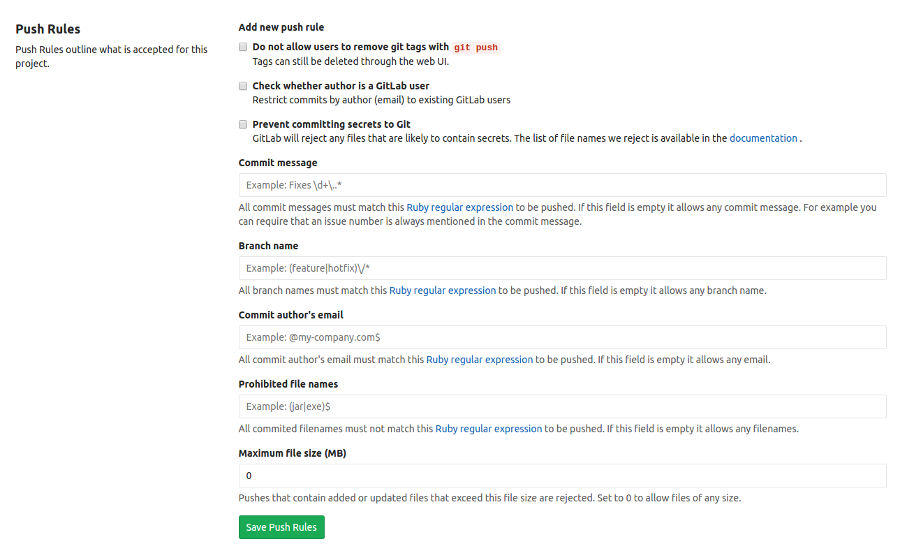

# Push Rules

Sometimes you need additional control over pushes to your repository.
GitLab already offers [protected branches][protected-branches].
But there are cases when you need some specific rules like preventing git tag removal or enforcing a special format for commit messages.
GitLab Enterprise Edition offers a user-friendly interface for such cases.

Push Rules are defined per project so you can have different rules applied to different projects depending on your needs.
Push Rules settings can be found under "Push Rules" at the Project settings -> Repository page.

## How to use

Let's assume you have the following requirements for your workflow:

* every commit should reference a JIRA issue. For example: `Refactored css. Fixes JIRA-123.`
* users should not be able to remove git tags with `git push`

All you need to do is write simple regular expression that requires mention of a JIRA issue in a commit message.
It can be something like this `/JIRA\-\d+/`.
Just paste regular expression into the commit message textfield (without start and ending slash) and save changes.
See the screenshot below:



Now when a user tries to push a commit like `Bugfix` - their push will be declined.
Only pushing commits with messages like `Bugfix according to JIRA-123` will be accepted.


## Prevent pushing secrets to the repository

You can turn on a predefined blacklist of files which won't be allowed to be pushed to a repository.

By selecting the checkbox *Prevent committing secrets to Git*, GitLab prevents pushes to the repository when a file matches a regular expression as read from `lib/gitlab/checks/files_blacklist.yml` (make sure you are at the right branch as your GitLab version when viewing this file).

Below is the list of what will be rejected by these regular expressions :

```shell
#####################
# AWS CLI credential blobs
#####################
.aws/credentials
aws/credentials
homefolder/aws/credentials

#####################
# Private RSA SSH keys
#####################
/ssh/id_rsa
/.ssh/personal_rsa
/config/server_rsa
id_rsa
.id_rsa

#####################
# Private DSA SSH keys
#####################
/ssh/id_dsa
/.ssh/personal_dsa
/config/server_dsa
id_dsa
.id_dsa

#####################
# Private ed25519 SSH keys
#####################
/ssh/id_ed25519
/.ssh/personal_ed25519
/config/server_ed25519
id_ed25519
.id_ed25519

#####################
# Private ECDSA SSH keys
#####################
/ssh/id_ecdsa
/.ssh/personal_ecdsa
/config/server_ecdsa
id_ecdsa
.id_ecdsa

#####################
# Any file with .pem or .key extensions
#####################
secret.pem
private.key

#####################
# Any file ending with _history or .history extension
#####################
pry.history
bash_history

```

[protected-branches]: https://docs.gitlab.com/ee/user/project/protected_branches.html "Protected Branches documentation"
