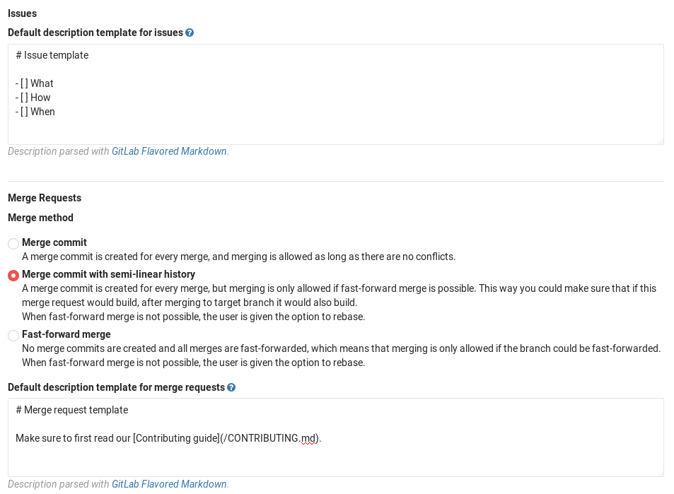

# Description templates

>[Introduced][ce-4981] in GitLab 8.11.

We all know that a properly submitted issue is more likely to be addressed in
a timely manner by the developers of a project.

Description templates allow you to define context-specific templates for issue
and merge request description fields for your project, as well as help filter
out a lot of unnecessary noise from issues.

## Overview

By using the description templates, users that create a new issue or merge
request can select a description template to help them communicate with other
contributors effectively.

Every GitLab project can define its own set of description templates as they
are added to the root directory of a GitLab project's repository.

Description templates must be written in [Markdown](../markdown.md) and stored
in your project's repository under a directory named `.gitlab`. Only the
templates of the default branch will be taken into account.

## Creating issue templates

Create a new Markdown (`.md`) file inside the `.gitlab/issue_templates/`
directory in your repository. Commit and push to your default branch.

## Creating merge request templates

Similarly to issue templates, create a new Markdown (`.md`) file inside the
`.gitlab/merge_request_templates/` directory in your repository. Commit and
push to your default branch.

## Using the templates

Let's take for example that you've created the file `.gitlab/issue_templates/Bug.md`.
This will enable the `Bug` dropdown option when creating or editing issues. When
`Bug` is selected, the content from the `Bug.md` template file will be copied
to the issue description field. The 'Reset template' button will discard any
changes you made after picking the template and return it to its initial status.

## Setting a default template for issues and merge requests

>
**Notes:**
- This feature was introduced before [description templates](#overview) and is
  available only for [GitLab Enterprise Starter][products]. It can be enabled
  in the project's settings.
- Templates for issues were [introduced][ee-28] in GitLab EE 8.1.
- Templates for merge requests were [introduced][ee-7478ece] in GitLab EE 6.9.

The visibility of issues and/or merge requests should be set to either "Everyone
with access" or "Only team members" in your project's **Settings** otherwise the
template text areas won't show. This is the default behavior so in most cases
you should be fine.

Go to your project's **Settings** and fill in the "Default description template
for issues" and "Default description template for merge requests" text areas
for issues and merge requests respectively. Since GitLab issues and merge
request support [Markdown](../markdown.md), you can use special markup like
headings, lists, etc.

After you add the description, hit **Save changes** for the settings to take
effect. Now, every time a new issue or merge request is created, it will be
pre-filled with the text you entered in the template(s).

[ce-4981]: https://gitlab.com/gitlab-org/gitlab-ce/merge_requests/4981
[ee-28]: https://gitlab.com/gitlab-org/gitlab-ee/merge_requests/28 "Merge Request for adding issues template"
[ee-7478ece]: https://gitlab.com/gitlab-org/gitlab-ee/commit/7478ece8b48e80782b5465b96c79f85cc91d391b "Commit that introduced merge requests templates"
[products]: https://about.gitlab.com/products/
