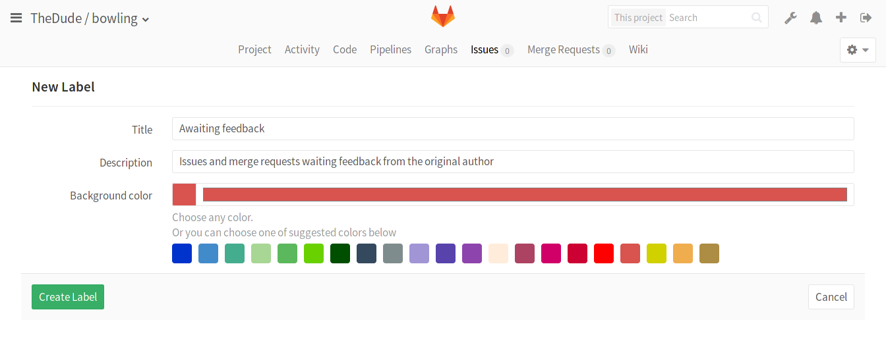
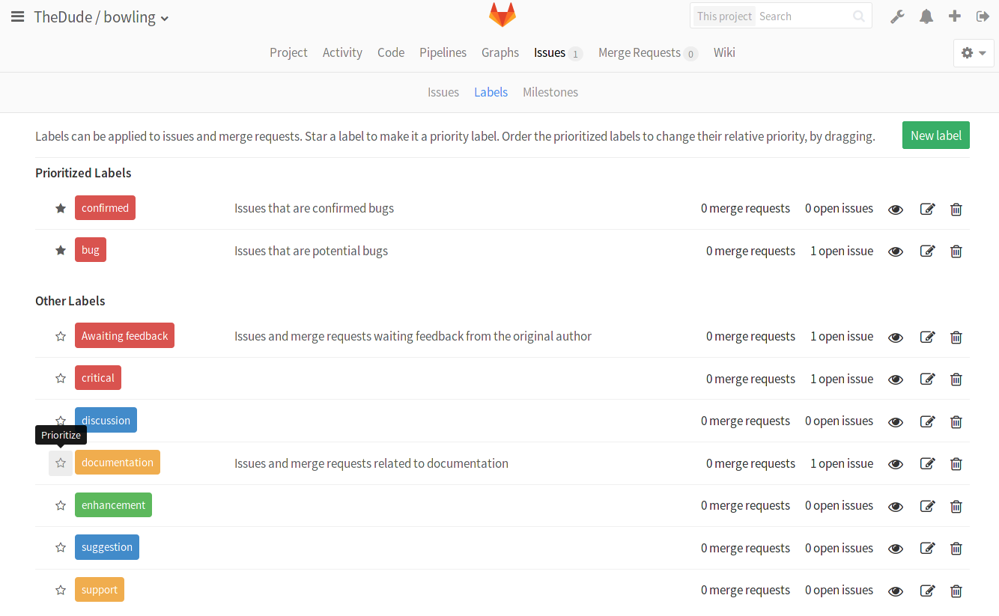
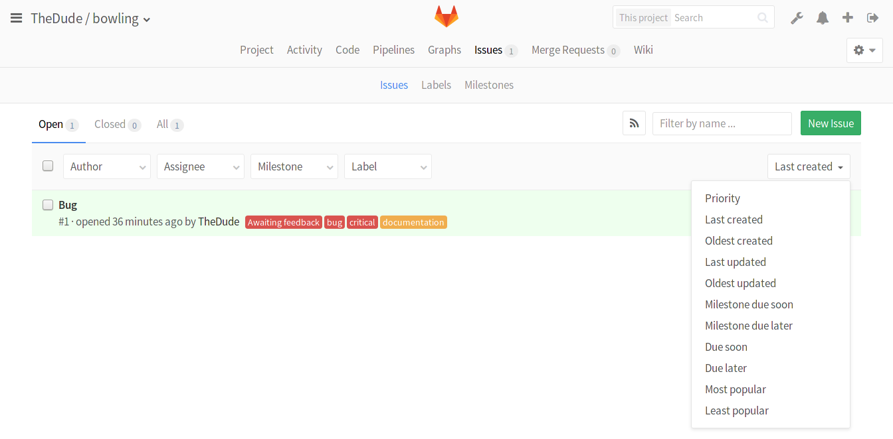
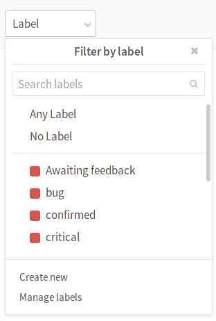
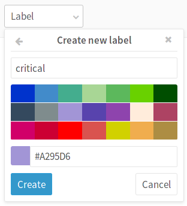
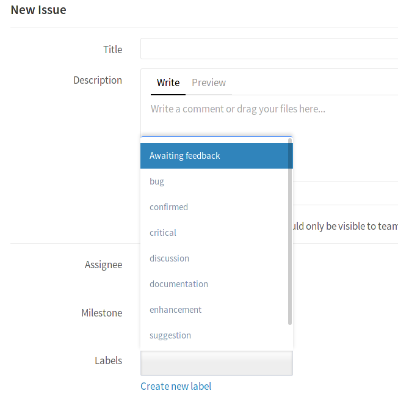
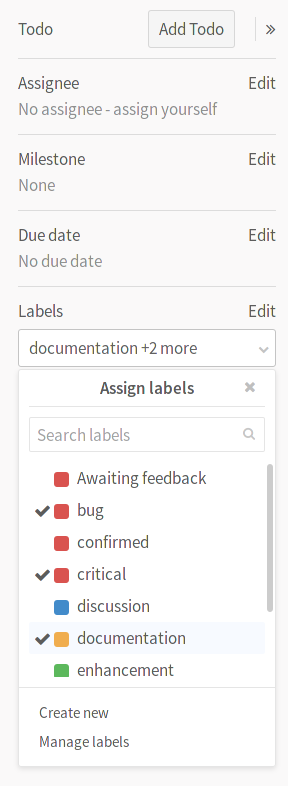
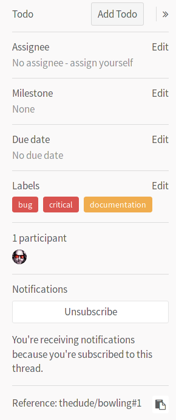
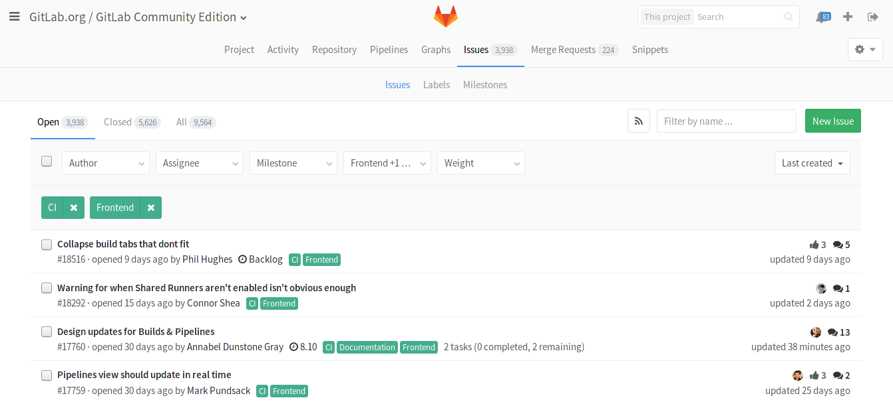
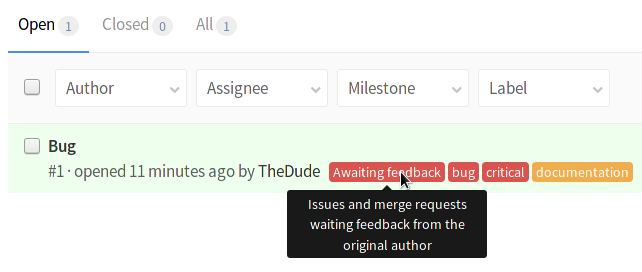

# Labels

Labels provide an easy way to categorize the issues or merge requests based on
descriptive titles like `bug`, `documentation` or any other text you feel like.
They can have different colors, a description, and are visible throughout
the issue tracker or inside each issue individually.

With labels, you can navigate the issue tracker and filter any bloated
information to visualize only the issues you are interested in. Let's see how
that works.

## Create new labels

>**Note:**
A permission level of `Developer` or higher is required in order to manage
labels.

Head over a single project and navigate to **Issues > Labels**.

The first time you visit this page, you'll notice that there are no labels
created yet.

Creating a new label from scratch is as easy as pressing the **New label**
button. From there on you can choose the name, give it an optional description,
a color and you are set.

When you are ready press the **Create label** button to create the new label.

---

## Default Labels

It's possible to populate the labels for your project from a set of predefined labels.

### Generate GitLab's predefined label set

Click the link to 'Generate a default set of labels' and GitLab will
generate a set of predefined labels for you. There are 8 default generated labels
in total and you can see them in the screenshot below.

---

## Labels Overview

You can see that from the labels page you can have an overview of the number of
issues and merge requests assigned to each label.

## Prioritize labels

>**Notes:**
>
> - Introduced in GitLab 8.9.
> - Priority sorting is based on the highest priority label only. This might
>   change in the future, follow the discussion in
>   https://gitlab.com/gitlab-org/gitlab-ce/issues/18554.

Prioritized labels are like any other label, but sorted by priority. This allows
you to sort issues and merge requests by priority.

To prioritize labels, navigate to your project's **Issues > Labels** and click
on the star icon next to them to put them in the priority list. Click on the
star icon again to remove them from the list.

From there, you can drag them around to set the desired priority. Priority is
set from high to low with an ascending order. Labels with no priority, count as
having their priority set to null.

Now that you have labels prioritized, you can use the 'Priority' filter in the
issues or merge requests tracker. Those with the highest priority label, will
appear on top.

## Subscribe to labels

If you don’t want to miss issues or merge requests that are important to you,
simply subscribe to a label. You’ll get notified via email whenever the label gets added
to an issue or merge request, making sure you don’t miss a thing.

Go to your project's **Issues > Labels** area, find the label(s) you want to
subscribe to and click on the eye icon. Click again to unsubscribe.

If you work on a large or popular project, try subscribing only to the labels
that are relevant to you. You’ll notice it’ll be much easier to focus on what’s
important.

## Create a new label right from the issue tracker

> Introduced in GitLab 8.6.

There are times when you are already in the issue tracker searching for a
label, only to realize it doesn't exist. Instead of going to the **Labels**
page and being distracted from your original purpose, you can create new
labels on the fly.

Select **Create new** from the labels dropdown list, provide a name, pick a
color and hit **Create**.

## Assigning labels to issues and merge requests

There are generally two ways to assign a label to an issue or merge request.

You can assign a label when you first create or edit an issue or merge request.

---

The second way is by using the right sidebar when inside an issue or merge
request. Expand it and hit **Edit** in the labels area. Start typing the name
of the label you are looking for to narrow down the list, and select it. You
can add more than one labels at once. When done, click outside the sidebar area
for the changes to take effect.

---

To remove labels, expand the left sidebar and unmark them from the labels list.
Simple as that.

##  Use labels to filter issues

Once you start adding labels to your issues, you'll see the benefit of it.
Labels can have several uses, one of them being the quick filtering of issues
or merge requests.

Pick an existing label from the dropdown _Label_ menu or click on an existing
label from the issue tracker. In the latter case, you also get to see the
label description like shown below.

---

And if you added a description to your label, you can see it by hovering your
mouse over the label in the issue tracker or wherever else the label is
rendered.

