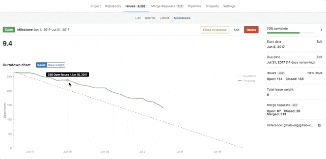
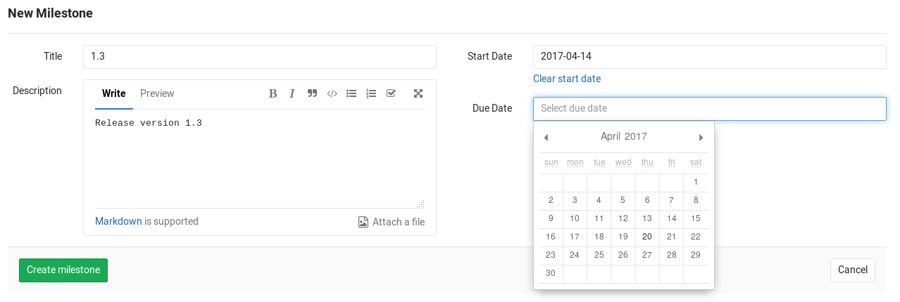
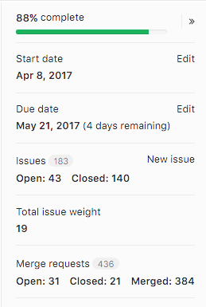

# Milestones

Milestones in GitLab are a way to track issues and merge requests created
to achieve a broader goal in a certain period of time.

## Overview

Milestones allow you to organize issues and merge requests into a cohesive group,
optionally setting a start and a due date.

With milestones you can set a deadline for certain achievement you're targeting,
and assign this milestone to issues and merge requests that together compose
this broader goal.

Milestones are a valuable tool to track the development of the process of achieving that goal.
From a milestone, you view the status of issues and merge requests, its contributors,
and opened and closed issues for each label.

With [GitLab Enterprise Edition Starter](https://about.gitlab.com/gitlab-ee/),
you will also see a [Burndown Chart](#burndown-charts) for your milestone, which
gives a visual insight over the progress of the conclusion of that milestone:

## Use cases

There are numerous cases you can create a milestone for. For example:

- Track an upcoming software version
- Track the launch of a new product
- Track the progress of achievements per quarter for your team
- Track the community contribution for a new feature in your open source application

## Creating a project milestone

>**Note:**
You need [Master permissions](../../permissions.md) in order to create a milestone.

You can find the milestones page under your project's **Issues ➔ Milestones**.
To create a new milestone, simply click the **New milestone** button when in the
milestones page. A milestone can have a title, a description and start/due dates.
Once you fill in all the details, hit the **Create milestone** button.

>**Note:**
The start/due dates are required if you intend to use [Burndown charts](#burndown-charts).

## Creating a group milestone

>**Note:**
You need [Master permissions](../../permissions.md) in order to create a milestone.

You can create a milestone for a group that will be shared across group projects.
On the group's **Issues ➔ Milestones** page, you will be able to see the state
of that milestone and the issues/merge requests count that it shares across the group projects. To create a new milestone click the **New milestone** button. The form is the same as when creating a milestone for a specific project which you can find in the previous item.

In addition to that you will be able to filter issues or merge requests by group milestones in all projects that belongs to the milestone group.

## Milestone promotion

You will be able to promote a project milestone to a group milestone [in the future](https://gitlab.com/gitlab-org/gitlab-ce/issues/35833).

## Special milestone filters

In addition to the milestones that exist in the project or group, there are some
special options available when filtering by milestone:

* **No Milestone** - only show issues or merge requests without a milestone.
* **Upcoming** - show issues or merge request that belong to the next open
  milestone with a due date, by project. (For example: if project A has
  milestone v1 due in three days, and project B has milestone v2 due in a week,
  then this will show issues or merge requests from milestone v1 in project A
  and milestone v2 in project B.)
* **Started** - show issues or merge requests from any milestone with a start
  date less than today. Note that this can return results from several
  milestones in the same project.

## Milestone progress statistics

Milestone statistics can be viewed in the milestone sidebar. The milestone percentage statistic
is calculated as; closed and merged merge requests plus all closed issues divided by
total merge requests and issues.

## Burndown Charts

[Burndown Charts](burndown_charts.md), available in
[GitLab Enterprise Edition Starter](https://about.gitlab.com/gitlab-ee),
are visual representations of the progress of completing a milestone.

Burndown charts are only available for project milestones currently. They will be available for group milestones [in the future](https://gitlab.com/gitlab-org/gitlab-ee/issues/3064).

## Quick actions

[Quick actions](../quick_actions.md) are available for assigning and removing project milestones only. [In the future](https://gitlab.com/gitlab-org/gitlab-ce/issues/34778), this will also apply to group milestones.
