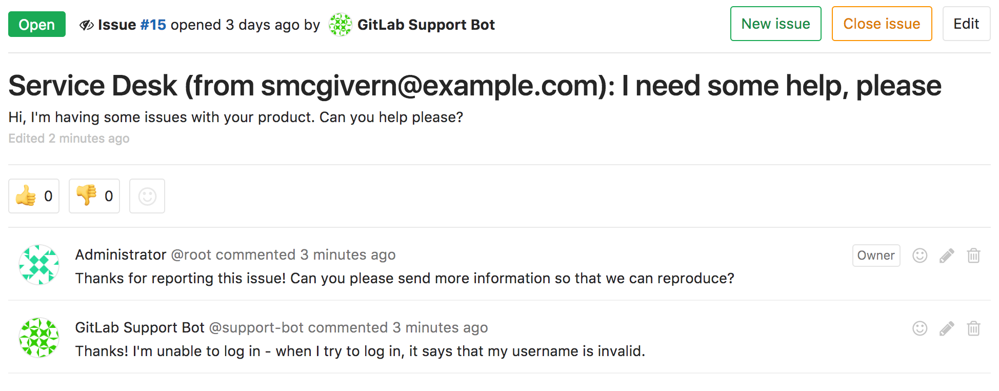

# Service Desk

> [Introduced][ee-149] in [GitLab Enterprise Edition Premium][ee] 9.1.

GitLab Service Desk is a simple way to allow people to create issues in your
GitLab instance without needing their own user account.

It provides a unique email address for end users to create issues in a project,
and replies can be sent either through the GitLab interface or by email. End
users will only see the thread through email.

## Configuring Service Desk

1.   [Set up reply by email][reply-by-email] for the GitLab instance. This must
     support [email sub-addressing][email-sub-addressing].
2.   As an administrator user on your GitLab instance, go to a project's settings
     page.
3.   If you have the correct access and an Enterprise Edition Premium license,
     you will see an option to set up Service Desk:

     
4.   Checking that box will enable Service Desk for the project, and show a
     unique email address to email issues to the project. These issues will be
     [confidential], so they will only be visible to project members.

     **Warning**: as the screenshot below shows, this email address can be used
     by anyone to create an issue on this project, whether or not they have
     access to your GitLab instance. We recommend **putting this behind an
     alias** so that it can be changed if needed, and
     **[enabling Akismet][akismet]** on your GitLab instance to add spam
     checking to this service.

     
5.   Service Desk is now enabled for this project!

## Using Service Desk

### As an end user (issue creator)

To create a Service Desk issue, an end user doesn't need to know anything about
the GitLab instance. They just send an email to the address they are given, and
receive an email back confirming receipt:

This also gives the end user an option to unsubscribe.

If they don't choose to unsubscribe, then any new comments added to the issue
will be sent as emails:

And any responses they send will be displayed in the issue itself.

### As a responder to the issue

For responders to the issue, everything works as normal. Messages from the end
user will show as coming from the special Support Bot user, but apart from that,
you can read and write comments as normal:

[ee-149]: https://gitlab.com/gitlab-org/gitlab-ee/issues/149 "Service Desk with email"
[ee]: https://about.gitlab.com/gitlab-ee/ "GitLab Enterprise Edition landing page"
[reply-by-email]: ../../administration/reply_by_email.md#set-it-up
[email-sub-addressing]: ../../administration/reply_by_email.md#email-sub-addressing
[confidential]: ./issues/confidential_issues.md "Confidential issues"
[akismet]: ../../integration/akismet.md
